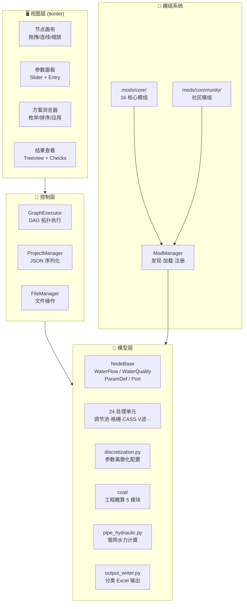
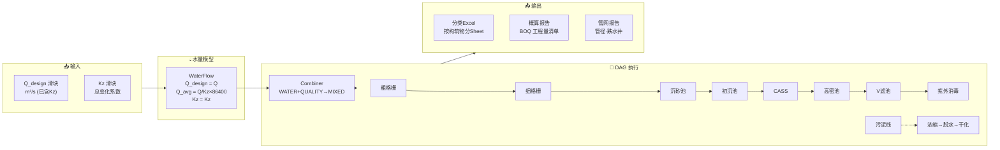
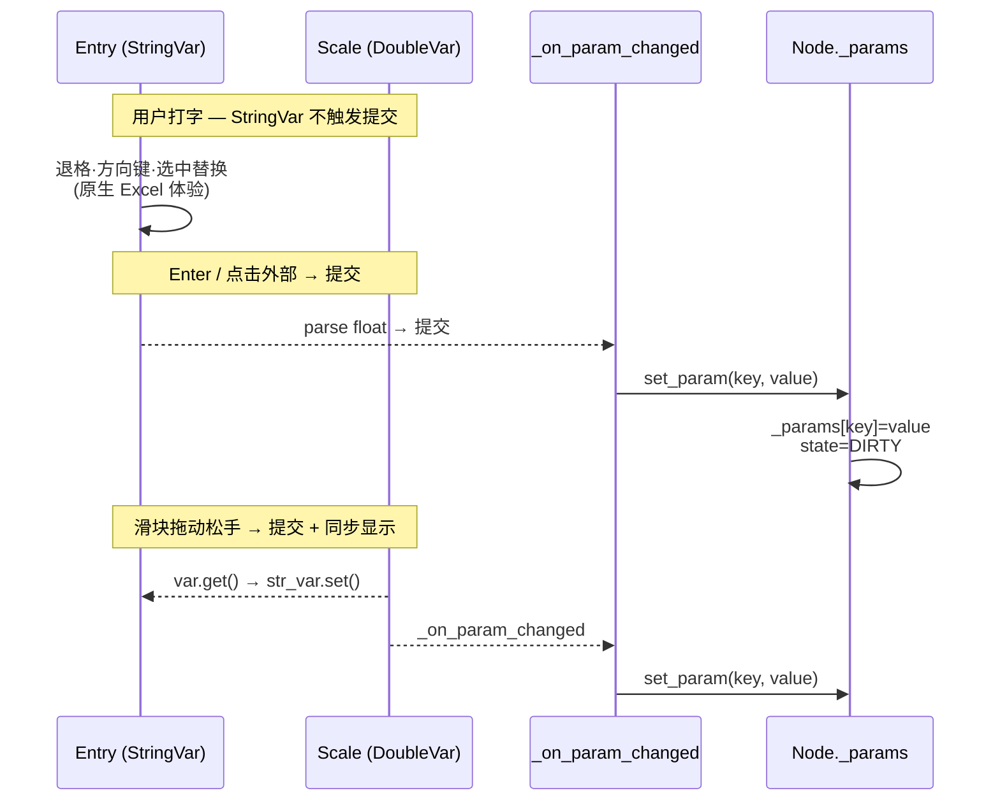
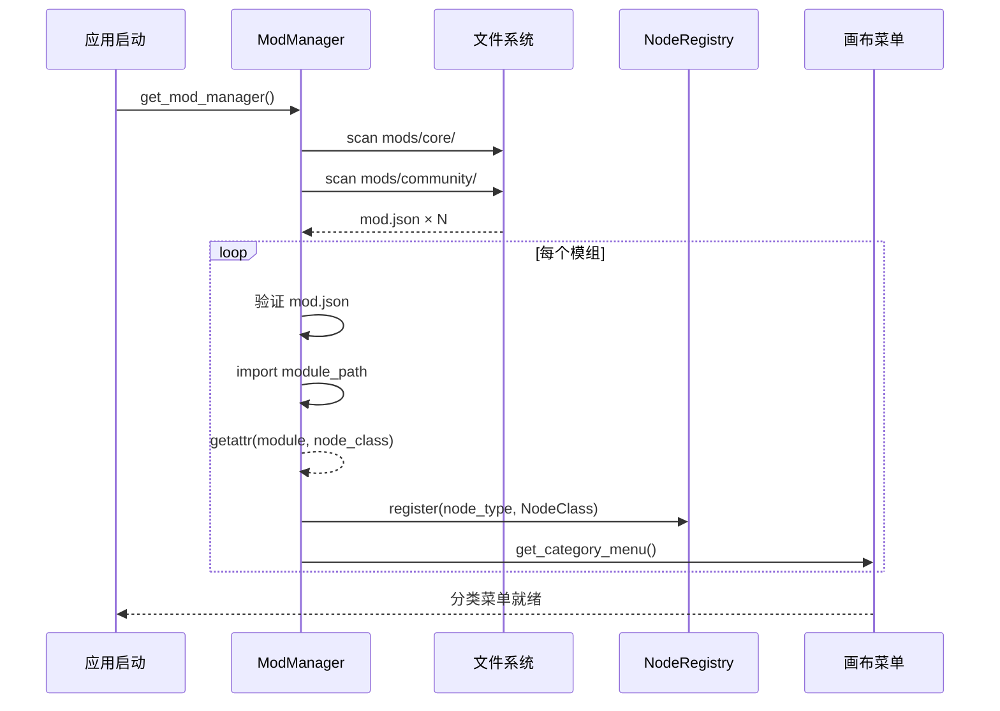
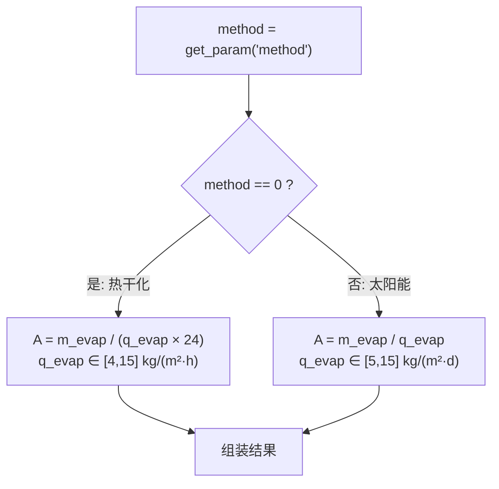
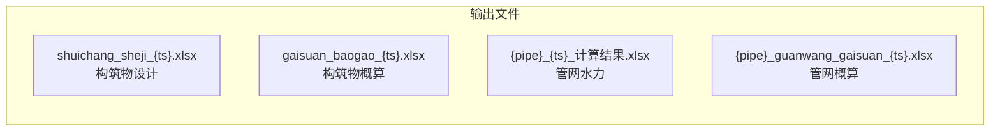

# 排水工程设计工具 v3.2 — 架构与数据流

> 生成日期: 2026-05-19

---

## 一、系统分层架构



---

## 二、核心数据流（水量→计算→输出）



---

## 三、参数输入与同步机制



---

## 四、模组加载时序



---

## 五、格栅计算流程（示例：细格栅）

```mermaid
flowchart TD
    A["读取参数<br/>n, b, α, h, v, v₁, s"] --> B["单台流量<br/>q = Q_design / n"]
    B --> C["间隙数<br/>n_gap = ceil(q·√sinα / b·h·v)"]
    C --> D["栅槽宽 B<br/>B = s·(n_gap-1) + b·n_gap + 0.2"]
    D --> E["校核流速<br/>v_checked = q·√sinα / b·h·n_gap"]
    E --> F["水头损失<br/>ξ = β·(s/b)^(4/3)<br/>h₁ = 3·ξ·v²/(2g)·sinα"]
    F --> G{"约束校核"}
    G -->|v∈[0.6,1.0]| H1["✅ 流速"]
    G -->|v₁∈[0.4,0.9]| H2["✅ 渠速"]
    G -->|B₁<B| H3["✅ 宽度"]
    G -->|h₁≤0.3m| H4["✅ 水头损失"]
    H1 & H2 & H3 & H4 --> I["组装 NodeResult → 下游"]
```

---

## 六、污泥干化面积分支



---

## 七、输出文件命名



各输出文件均包含 `YYYYMMDD_HHMMSS` 时间戳；管网相关文件还包含输入 Excel 名称前缀。
